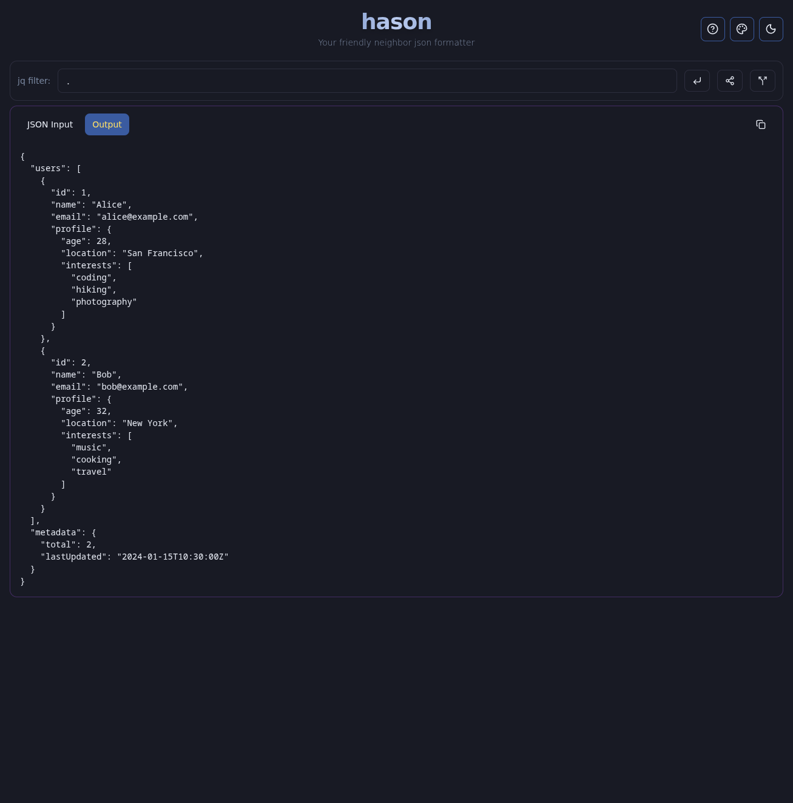

# Hason - JSON Formatter PWA

A fast, modern JSON formatter and processor that works offline. Transform, validate, and format JSON data with jq filters in your browser.



## What Problem Does This Solve?

- **Complex JSON Processing**: Parse and transform large JSON datasets using powerful jq syntax
- **Offline Capability**: Works without internet connection as a Progressive Web App
- **Developer Productivity**: Quickly format, validate, and extract data from JSON responses
- **Cross-Platform**: Runs in any modern browser, installable as a native app

## Key Features

- 🔄 **jq Filtering**: Advanced JSON processing with jq syntax
- 📱 **PWA Support**: Install as an app, works offline  
- 🎨 **Multiple Themes**: Light/dark mode with theme switching
- 📋 **Copy Support**: One-click clipboard copying
- 🔗 **URL State**: Share JSON and filters via URL
- ⚡ **Fast**: Built with Vite for instant HMR

## Quick Start

```bash
# Clone and setup
git clone <your-repo-url>
cd hason
npm ci

# Start development server
npm run dev
```

Visit `http://localhost:5173` to start formatting JSON.

## Architecture

**Tech Stack**: React 19, TypeScript, Vite 6, PWA with Workbox  
**Build System**: Nix for reproducible jq WebAssembly builds  
**Testing**: Vitest (unit) + Playwright (e2e)

For detailed setup instructions, build configuration, and Nix development environment, see [docs/nix.md](docs/nix.md).

## License

MIT