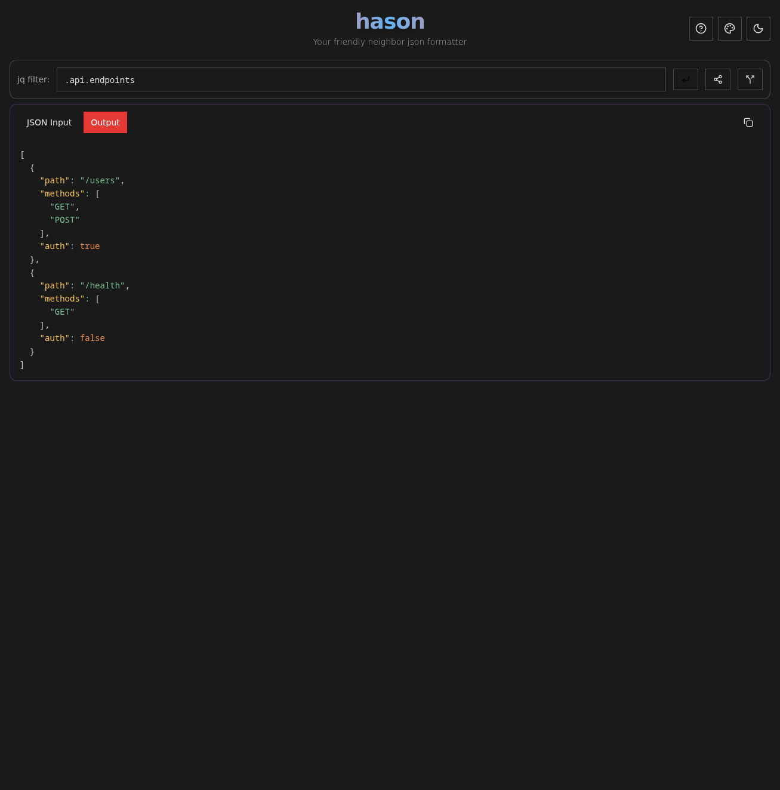

# Hason - JSON Formatter PWA

A fast, modern JSON formatter and processor that works offline. Transform, validate, and format JSON data with jq filters in your browser.



## 🏗️ Monorepo Structure

This project is organized as a pnpm workspace monorepo:

```
hason/
├── packages/
│   ├── app/         # React PWA application  
│   └── jq-hason/    # WebAssembly jq processor (npm package)
├── docs/            # Documentation (Nix setup, etc.)
└── .github/         # CI/CD workflows with shared actions
```

## What Problem Does This Solve?

- **Complex JSON Processing**: Parse and transform large JSON datasets using powerful jq syntax
- **Offline Capability**: Works without internet connection as a Progressive Web App
- **Developer Productivity**: Quickly format, validate, and extract data from JSON responses
- **Cross-Platform**: Runs in any modern browser, installable as a native app

## Key Features

- 🔄 **jq Filtering**: Advanced JSON processing with jq syntax
- 📱 **PWA Support**: Install as an app, works offline  
- 🎨 **Multiple Themes**: Light/dark mode with theme switching
- 📋 **Copy Support**: One-click clipboard copying
- 🔗 **URL State**: Share JSON and filters via URL
- ⚡ **Fast**: Built with Vite for instant HMR

## Quick Start

```bash
# Clone and setup
git clone <your-repo-url>
cd hason

# Install dependencies (uses pnpm workspace)
pnpm install

# Setup jq for development (if using Nix)
pnpm run setup:jq

# Start development server
pnpm run dev
```

Visit `http://localhost:5173` to start formatting JSON.

### 🐳 Docker Deployment

Quick start with Docker:

```bash
# Build and run locally
docker-compose up

# Or use pre-built image
docker run -p 3000:80 ghcr.io/wesbragagt/hason:latest
```

Visit `http://localhost:3000` to access the application.

See [Docker Documentation](docs/docker.md) for advanced deployment options, Kubernetes configs, and troubleshooting.

### Using jq-hason as an npm Package

The `jq-hason` package can be used independently in other projects:

```bash
npm install jq-hason
```

```typescript
import { jq, getJQVersion } from 'jq-hason';

// Process JSON with jq filter
const result = await jq({ name: "John", age: 30 }, '.name');
console.log(result); // "John"

// Get jq version
console.log(getJQVersion()); // "1.8.1"
```

## Architecture

**Tech Stack**: React 19, TypeScript, Vite 6, PWA with Workbox  
**Build System**: Nix for reproducible jq WebAssembly builds  
**Package Manager**: pnpm with workspace support  
**Bundling**: tsdown for npm package distribution  
**Testing**: Vitest (unit) + Playwright (e2e)

## Available Commands

### Root Workspace Commands
```bash
pnpm run dev           # Start app development server
pnpm run build         # Build entire workspace (packages + app)
pnpm run test          # Run all tests
pnpm run setup:jq      # Setup jq binary for development
pnpm run build:wasm    # Build jq WebAssembly files
```

### Nix Commands (for WASM builds)
```bash
nix run .#setup-jq                                    # Setup jq binary
nix run .#build-jq-wasm                               # Build and copy WASM files
nix run .#copy-wasm-to-app                            # Copy WASM to app
nix run .#update-jq-version -- "1.9.0" "jq-1.9.0" "sha256-hash"  # Update jq version
```

For detailed setup instructions, build configuration, and Nix development environment, see [docs/nix.md](docs/nix.md).

## License

MIT